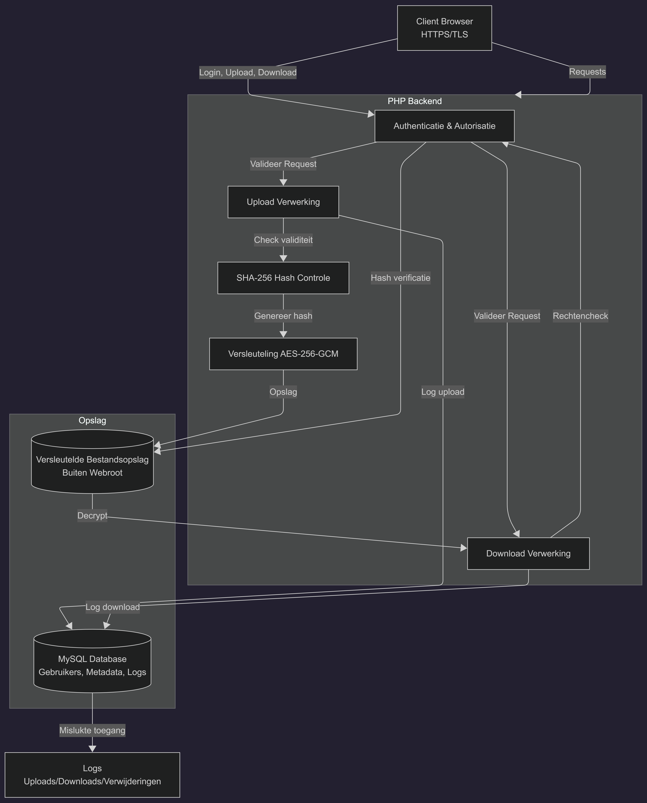

## Probleemanalyse

16-99 leventijd, mensen die bestanden willen delen | Text en plaatjes, geen onderwerp

## Security Requirements

-   Encryptie van bestanden tijdens transport: Alle bestandsoverdrachten moeten plaatsvinden via een beveiligde HTTPS-verbinding met TLS-encryptie. Hierdoor kunnen bestanden tijdens het uploaden en downloaden niet worden onderschept of gelezen door onbevoegden.

-   Encryptie van bestanden bij opslag: Geüploade bestanden moeten versleuteld worden opgeslagen met het AES-256-GCM-algoritme. Alleen geautoriseerde systemen mogen toegang hebben tot de encryptiesleutels die nodig zijn voor het ontsleutelen van bestanden.

-   Authenticatie van gebruikers: Gebruikers moeten zich aanmelden met een gebruikersnaam en wachtwoord voordat zij toegang krijgen tot bestanden. Wachtwoorden worden gehasht opgeslagen met een veilig hashing-algoritme zoals bcrypt of Argon2.

-   Autorisatie en toegangscontrole: Het systeem moet controleren of een gebruiker voldoende rechten heeft om een bestand te uploaden, bekijken, downloaden of verwijderen. Gebruikers mogen alleen toegang hebben tot bestanden waarvoor zij bevoegd zijn.

-   Controle op integriteit van bestanden: Voor elk bestand moet een hashwaarde (bijvoorbeeld SHA-256) worden berekend en opgeslagen. Bij het downloaden of verwerken van een bestand kan deze hash opnieuw worden berekend om te controleren of het bestand niet is gewijzigd of beschadigd.

-   Logging van bestandsoverdrachten: Alle uploads, downloads, verwijderingen en mislukte toegangspogingen moeten worden geregistreerd in logbestanden. De logs moeten minimaal bevatten: Tijdstip van de actie, Gebruikers-ID, Bestands-ID, Type actie en resultaat van de actie.

-   Foutafhandeling bij mislukte transfers: Het systeem moet fouten tijdens uploads en downloads detecteren en afhandelen. Bij een mislukte overdracht moet:
    -   De gebruiker een duidelijke foutmelding ontvangen.
    -   De fout worden geregistreerd in de logs.
    -   Onvolledige bestanden automatisch worden verwijderd. 8. Bescherming tegen ongeautoriseerde toegang.

Het systeem moet pogingen tot ongeautoriseerde toegang detecteren en blokkeren. Meerdere mislukte inlogpogingen kunnen leiden tot tijdelijke blokkering van het account.

Geüploade bestanden moeten worden gecontroleerd op schadelijke software voordat ze worden opgeslagen of beschikbaar worden gesteld aan andere gebruikers.

Bestanden en databases moeten regelmatig worden geback-upt. Back-ups moeten eveneens versleuteld worden opgeslagen zodat gegevens kunnen worden hersteld bij systeemstoringen of dataverlies.

### Summary: Lijst met Security Requirements

HTTPS/TLS voor alle bestandsoverdrachten.
AES-256-GCM encryptie voor opgeslagen bestanden.
Veilige authenticatie met gehashte wachtwoorden.
Autorisatie op basis van gebruikersrechten.
SHA-256 integriteitscontrole van bestanden.
Logging van alle bestandsoverdrachten en beveiligingsgebeurtenissen.
Correcte foutafhandeling bij mislukte transfers.
Bescherming tegen ongeautoriseerde toegang.
Malwarecontrole van uploads.
Regelmatige versleutelde back-ups en herstelmogelijkheden.

## Technische keuzes

-   Front-end: HTML, CSS en JavaScript. Deze talen zijn de standaard voor webontwikkeling en worden door alle moderne browsers ondersteund. Ook zijn onze programmeurs zeer bekend met deze talen. We hebben besloten geen gebruik te maken van JS frameworks om securitygerelateerde redenen.
-   Back-end: PHP. PHP is een veelgebruikte server-side programmeertaal die goed samenwerkt met webservers en databases. Daarnaast is PHP goed gedocumenteerd en heeft het een groot aanbod aan libraries.
-   Database: MySQL. MySQL is snel en heeft goede integratie met PHP.
-   Netwerkprotocol: uitsluitend HTTPS; alle HTTP-verzoeken worden doorgestuurd naar HTTPS. HTTPS zorgt ervoor dat gegevens die tussen de user en de server worden verzonden niet kunnen worden onderschept of aangepast. Het automatisch doorsturen van HTTP-verzoeken voorkomt dat users per ongeluk een onbeveiligde verbinding gebruiken.
-   Encryptie: TLS. TLS versleutelt het dataverkeer tussen de client en de server, waardoor gevoelige informatie zoals wachtwoorden en persoonlijke gegevens beschermd blijft tijdens verzending.
-   Bestandsopslag: bestanden worden opgeslagen op de server buiten de public webroot. Uploads worden gevalideerd op bestandstype en bestandsgrootte. Door bestanden buiten de publieke webroot op te slaan, kunnen ze niet rechtstreeks via een URL worden benaderd. De validatie van uploads voorkomt schadelijke bestanden en onnodig grote bestanden die opslagruimte opvullen en serversnelheid verminderen.

## Architectuurontwerp

Het systeem bestaat uit een client (browser), een PHP-backend, een MySQL-database en een versleutelde bestandsopslag buiten de webroot. Alle communicatie loopt via HTTPS/TLS, waardoor data tijdens transport niet kan worden afgeluisterd of aangepast.

De client handled login en bestandsacties (upload/download) en communiceert met de server via HTTPS.

De server valideert elke request, voert authenticatie en autorisatie uit, en verwerkt bestanden via PHP. Tijdens uploads worden bestanden eerst gecontroleerd of ze valid zijn, daarna krijgt elk bestand een SHA-256 hash voor integriteitscontrole en wordt het versleuteld opgeslagen met AES-256-GCM. Downloads worden alleen toegestaan na rechtencontrole en hash-verificatie.

De database slaat gebruikers, bestands(meta)data en logs op. Logs registreren onder andere uploads, downloads, verwijderingen en mislukte toegangspogingen.

### Diagram

